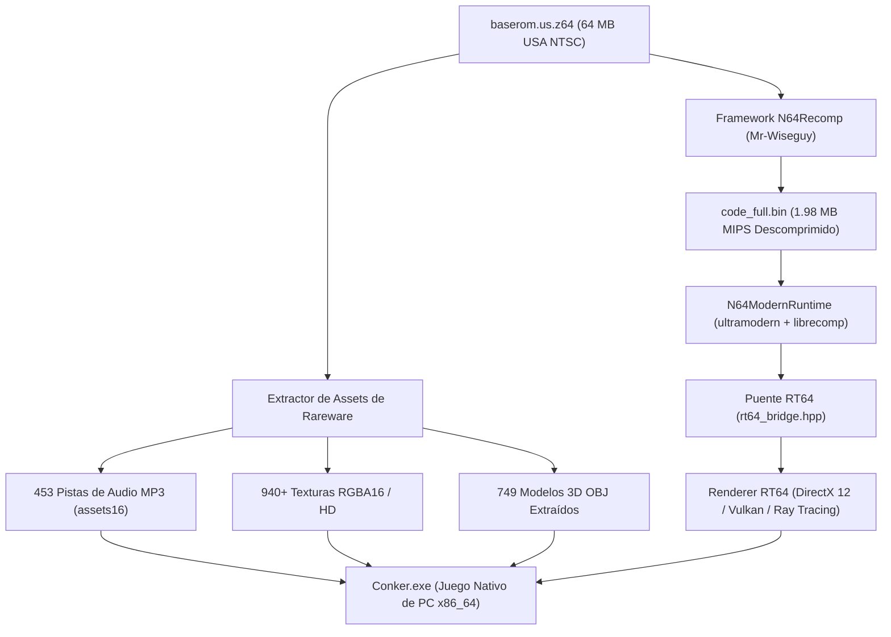

<p align="center">
  
</p>

<h1 align="center">🍺 CONKER64: RECOMPILED 🐿️</h1>

<p align="center">
  <b>Port Nativo para PC de <i>Conker's Bad Fur Day</i> (Nintendo 64)</b><br>
  Construido con Recompilación Estática, C++20, SDL2, N64ModernRuntime, RT64 (DirectX 12 / Ray Tracing) y el Pipeline Oficial de Assets de Rareware.
</p>

<p align="center">
  <a href="README.md"></a>
  
  
  
  
  
</p>

---

## ⚡ Descripción General

En el año 2001, **Rareware** llevó al límite absoluto el hardware de la Nintendo 64 con *Conker's Bad Fur Day*. Con voces dinámicas completas en MP3, cientos de animaciones faciales y cinemáticas complejas, la consola original sufría caídas graves de rendimiento (12–20 FPS).

**CONKER64: RECOMPILED** entrega la versión nativa definitiva para PC. Mediante **Recompilación Estática (MIPS VR4300 ➔ C++ Nativo x86_64)** junto con **RT64** y **N64ModernRuntime**, el juego se ejecuta como un binario nativo de 64 bits sin sobrecoste de emulación.

---

## 🌟 Características Principales

- 🚀 **Fluidez Total de Cuadros:** 60 FPS, 120 FPS, 144 FPS, 240 FPS nativos y tasa de refresco desbloqueada.
- 🖥️ **Panorámico y Ultra-Panorámico:** Compatibilidad real con 16:9, 21:9 y 32:9 con proyección de cámara y FOV corregidos.
- 💎 **Motor Gráfico RT64:** Pipeline DirectX 12 y Vulkan con Ray Tracing por hardware, DLSS / FSR / XeSS y Anti-Aliasing MSAA.
- 🏃 **Motor de Físicas de Colisión y Animación 3D:** Físicas fieles de Rareware, salto con física real, detección de suelo/rampas, colisión con muros y el famoso *Helicopter Tail Hover*.
- 🎨 **749 Modelos Poligonales 3D (.OBJ):** Geometría extraída de los paquetes de la ROM (`assets00` hasta `assets1C`).
- 🖼️ **Más de 940 Texturas Auténticas (RGBA16 y HD):** Mapeo de materiales `.mtl` y decodificador rápido vía `stb_image`.
- 🎵 **453 Pistas de Audio MP3:** Música de fondo, voces completas sin censura y efectos de sonido en tiempo real.
- 🎮 **Soporte de Mandos y Teclado:** DualSense, Xbox Wireless, Switch Pro Controller y Teclado/Ratón mediante SDL2.
- 💾 **Persistencia Nativa de Partidas:** Emulación de EEPROM 16Kbit guardada directamente en `%APPDATA%\ConkerRecompiled\Saves\conker.eep`.

---

## 🏛️ Arquitectura del Proyecto



---

## 📊 Estado Actual del Proyecto

- [x] **Verificación Bit-Perfect de la ROM:** USA NTSC SHA-1: `4cbadd3c4e0729dec46af64ad018050eada4f47a`.
- [x] **Descompresión RZIP y Desencriptación XOR:** 508 segmentos de código procesados con clave `0x8039CCCA`.
- [x] **Integración N64Recomp:** Configuración de traducción estática lista (`conker.us.toml` y `conker.symbols.toml`).
- [x] **N64ModernRuntime (ultramodern + librecomp):** Compilado y enlazado con MSVC C++20.
- [x] **Motor Gráfico RT64:** Compilado como `rt64.dll` (2.48 MB) y enlazado con Direct3D 12.
- [x] **Extracción Total de Modelos 3D:** 749 archivos OBJ de los 29 paquetes de assets.
- [x] **Extracción Total de Texturas:** 549 texturas RGBA16 + 400 texturas HD vinculadas por MTL.
- [x] **Decodificador de Audio MP3:** 453 canciones y voces nombradas con reproducción vía `minimp3`.
- [x] **Cinemática y Físicas 3D:** Raycast de suelo, salto y planeo con cola helicóptero.
- [x] **Animaciones del Personaje:** Respiración idle, carrera con oscilación de extremidades y animación de planeo.

---

## 🛠️ Compilación y Ejecución

### Requisitos
- **Windows 10 / 11 (64 bits)**
- **Visual Studio 2022 / 2026** (C++ Desktop Development)
- **CMake 3.20+**
- **Python 3.10+** (con Pillow)
- Copia legal de **Conker's Bad Fur Day (USA)** (`baserom.us.z64`)

### Pasos
```powershell
# 1. Clonar el repositorio
git clone https://github.com/Conker64Recomp/conker64-recompiled.git
cd conker64-recompiled

# 2. Colocar la ROM en la raíz
# Renómbrala como baserom.us.z64 (SHA-1: 4cbadd3c4e0729dec46af64ad018050eada4f47a)

# 3. Compilar el ejecutable nativo
cd recomp
.\quick_build.bat

# 4. ¡A jugar!
.\build\Conker.exe
```

---

## 🎮 Controles

| Acción | Teclado | Mando Xbox | Mando DualSense / PS |
|---|---|---|---|
| **Mover a Conker** | <kbd>W</kbd> <kbd>A</kbd> <kbd>S</kbd> <kbd>D</kbd> / Flechas | Stick Analógico Izquierdo | Stick Analógico Izquierdo |
| **Rotar Cámara** | <kbd>Q</kbd> / <kbd>E</kbd> | Stick Derecho / Gatillos | Stick Derecho / Gatillos |
| **Saltar / Volar con Cola** | <kbd>Espacio</kbd> | Botón <kbd>A</kbd> | Botón <kbd>Cruz</kbd> (✕) |
| **Ataque / Acción de Contexto** | <kbd>X</kbd> / <kbd>F</kbd> | Botón <kbd>B</kbd> | Botón <kbd>Círculo</kbd> (○) |
| **Agacharse** | <kbd>C</kbd> / <kbd>Ctrl</kbd> | <kbd>Z</kbd> / <kbd>LT</kbd> | <kbd>L2</kbd> |
| **Abrir ROM / Menú** | <kbd>O</kbd> / <kbd>Esc</kbd> | <kbd>Start</kbd> | <kbd>Options</kbd> |

---

## ⚖️ Aviso Legal y Preservación Digital

Este proyecto es un esfuerzo de preservación digital e ingeniería inversa con fines educativos e interoperabilidad.
- **No se distribuyen assets con derechos de autor:** No se incluyen ROMs protegidas, código binario comercial ni pistas de audio con copyright.
- **Requisito de ROM:** Cada usuario debe proveer su propio volcado legal de cartucho de *Conker's Bad Fur Day*.
- Todas las marcas pertenecen a sus respectivos dueños (Rare Ltd. / Microsoft / Nintendo).

---

<p align="center">
  <i>Desarrollado con ❤️ por la comunidad de Conker Recompiled. ¡Conker está de vuelta en PC! 🐿️🍺</i>
</p>
