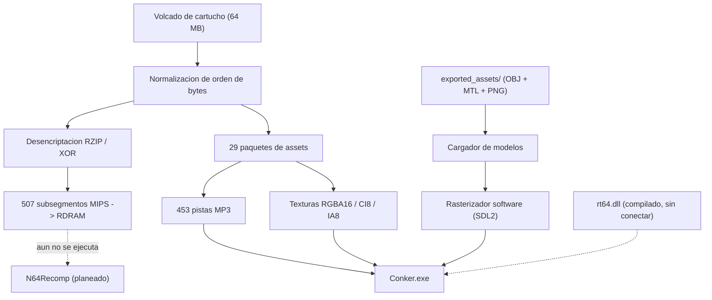

<p align="center">
  
</p>

<h1 align="center">🍺 CONKER64: RECOMPILED 🐿️</h1>

<p align="center">
  <b>Motor nativo en C++20 y pipeline de assets para <i>Conker's Bad Fur Day</i> (Nintendo 64)</b><br>
  Lee un volcado real de cartucho, desencripta y descomprime los archivos RZIP de Rareware,
  y renderiza una escena 3D explorable con los datos que recupera.
</p>

<p align="center">
  <a href="README.md"></a>
  
  
  
  
</p>

---

## ⚡ Qué es esto realmente

Esto **no es una recompilación estática terminada** de *Conker's Bad Fur Day*, y no permite
jugar al juego. Mejor dejarlo claro desde el principio.

Lo que **sí** es: un conjunto de herramientas de ingeniería inversa y un motor 3D escritos
desde cero en C++20 sobre SDL2, que:

- Carga un volcado real de cartucho de 64 MB y valida su cabecera.
- Rompe el formato contenedor RZIP de Rareware — tabla de offsets cifrada con XOR
  (clave `0x8039CCCA`) más cargas útiles en deflate crudo — y recupera **507 de 508
  subsegmentos de código ejecutable** (~2 MB de MIPS) en una RDRAM emulada de 8 MB.
- Indexa y reproduce **453 pistas de audio MP3** incrustadas en el cartucho.
- Decodifica todos los formatos de textura nativos de N64 (RGBA16/32, IA16/8, CI8/4, I8).
- Renderiza una escena 3D explorable con su propio rasterizador por software: sombreado
  Gouraud, back-face culling, ordenación por profundidad (algoritmo del pintor), niebla
  por distancia y un sistema de animación esquelética procedural para el personaje.

El código MIPS recuperado reside en RDRAM pero **todavía no se ejecuta**. Conectar
N64Recomp para que corra es el problema abierto central del proyecto — ver la hoja de ruta.

---

## 📊 Estado actual

### Funciona

| Área | Detalle |
|---|---|
| Carga de ROM | Detección de orden de bytes `.z64` / `.v64` / `.n64`, normalizado a big-endian. Cabecera parseada campo a campo. |
| Desencriptación RZIP | 508 offsets desencriptados, 507 subsegmentos de código descomprimidos en RDRAM. |
| Paquetes de assets | Los 29 paquetes de Rareware (`assets00`–`assets1C`) localizados y enumerados. |
| Audio | 453 pistas MP3 indexadas desde `assets16`, decodificadas con `minimp3` y remuestreadas al dispositivo de salida vía `SDL_AudioStream`. |
| Decodificación de texturas | RGBA16, RGBA32, IA16, IA8, CI8, CI4, I8 → RGBA8888. |
| Guardado | EEPROM de 16 Kbit (256 bloques × 8 bytes) persistida en `%APPDATA%\ConkerRecompiled\Saves\conker.eep`, tras los hooks `osEeprom*`. |
| Renderer | `SDL_RenderGeometry` por lotes — una llamada de dibujo por malla en vez de una por triángulo. Medido: 50–90 FPS a 1280×720 con una escena de 35 k triángulos. |
| Control del jugador | Movimiento relativo a cámara, gravedad, salto, colisión con muros y repisas, y el característico planeo con la cola. |

### Parcial

- **Modelos 3D extraídos.** Se recuperaron 750 archivos `.obj` de los paquetes, pero el
  extractor busca patrones de bytes en lugar de recorrer display lists F3DEX2 de verdad:
  **590 de ellos tienen menos de 10 caras**, y solo 20 superan las 100. El
  `conker_character.obj` incluido son 4 triángulos, así que el motor recurre a un modelo
  procedural para el personaje.
- **Materiales.** Existen 749 archivos `.mtl`, pero **todos apuntan a la misma textura**
  (`assets00_tex_006_32x32.png`). La asignación real por malla debe deducirse de los
  comandos `G_SETTIMG` / `G_SETTILE`.
- **Secuencia de intro.** Una máquina de estados de relleno con rectángulos de colores,
  no la cinemática real de Rareware.

### Sin empezar

- **Ejecución del código MIPS recompilado.** `conker.us.toml` y `conker.symbols.toml`
  están escritos, pero N64Recomp no se ha ejecutado nunca y `recomp/src/generated/`
  está vacío.
- **Integración de RT64.** `rt64.dll` compila y se copia junto al ejecutable, y
  `rt64_bridge.hpp` está escrito contra la interfaz de renderer de `ultramodern` — pero
  ningún archivo lo incluye todavía, así que todo el renderizado pasa por el rasterizador
  software. Ray tracing, DLSS/FSR/XeSS y escalado por hardware **no** están disponibles.
- Lógica de juego, enemigos, NPCs, niveles, HUD.

---

## 🏛️ Arquitectura



---

## 🛠️ Compilación

### Requisitos

- Windows 10 / 11 (x64)
- Visual Studio 2022 o superior, con la carga de trabajo de Desarrollo para escritorio con C++
- CMake 3.20+
- Un volcado obtenido legalmente de *Conker's Bad Fur Day (USA)*
  — SHA-1 `4cbadd3c4e0729dec46af64ad018050eada4f47a`

SDL2 y zlib los descarga CMake automáticamente; no hay que configurar nada a mano.

### Compilar

```powershell
cd recomp
.\build_game.bat
```

`build_game.bat` hace una configuración y compilación limpias. Para recompilaciones
incrementales después:

```powershell
.\quick_build.bat
```

### Ejecutar

Coloca tu ROM en la raíz del repositorio como `baserom.us.z64` y luego:

```powershell
.\build\Conker.exe
```

Sirve cualquiera de `.z64`, `.v64` o `.n64` — el cargador detecta el orden de bytes por la
firma en lugar de fiarse de la extensión del archivo. También puedes arrastrar una ROM a la
ventana, o pulsar <kbd>O</kbd> para buscarla.

Los assets se localizan respecto al ejecutable, así que funciona desde cualquier directorio
de trabajo.

---

## 🎮 Controles

| Acción | Teclado | Mando |
|---|---|---|
| Moverse | <kbd>W</kbd> <kbd>A</kbd> <kbd>S</kbd> <kbd>D</kbd> | Stick izquierdo |
| Rotar cámara | <kbd>Q</kbd> / <kbd>E</kbd> | C-Izquierda / C-Derecha |
| Saltar — mantener en el aire para planear | <kbd>Espacio</kbd> / <kbd>X</kbd> | <kbd>A</kbd> |
| Atacar | <kbd>C</kbd> / <kbd>Z</kbd> | <kbd>X</kbd> |
| Cambiar textura de la ROM | <kbd>Tab</kbd> / <kbd>1</kbd>–<kbd>9</kbd> | — |
| Abrir ROM | <kbd>O</kbd> | — |
| Salir | <kbd>Esc</kbd> | — |

El movimiento es relativo a la cámara: «adelante» sigue la dirección hacia la que hayas
girado la vista.

---

## 🗺️ Hoja de ruta

1. **Arreglar el extractor de assets.** Recorrer display lists F3DEX2 correctamente
   (`G_VTX` → pila de matrices → `G_TRI1`/`G_TRI2`) en vez de buscar patrones de bytes, y
   leer las texturas reales por malla desde `G_SETTIMG`/`G_SETTILE`. Esto es lo que
   desbloquea el ~98% de geometría restante.
2. **Ejecutar el código recompilado.** Inicializar los submódulos, compilar N64Recomp,
   traducir `code_full.bin` con los TOML existentes y compilar el C generado dentro del
   ejecutable.
3. **Conectar RT64.** `rt64_bridge.hpp` está escrito pero no lo referencia nadie;
   conectarlo requiere `N64ModernRuntime` compilado y un pipeline de display lists que le
   entregue comandos F3DEX2 reales.
4. **Sistemas de juego.** Enemigos, NPCs, carga de niveles, HUD.

---

## 🤝 Contribuir

La contribución más valiosa ahora mismo es el punto 1 de la hoja de ruta: el extractor de
assets. Todo lo demás está limitado por la calidad de la geometría extraída.

Para obtener los submódulos (necesarios para los puntos 2 y 3):

```powershell
git submodule update --init --recursive
```

---

## ⚖️ Aviso legal

Este proyecto es un trabajo de ingeniería inversa y preservación digital con fines
educativos y de interoperabilidad.

- **No se distribuye ningún asset con derechos de autor.** Este repositorio no contiene
  ROMs, ni código propietario del juego, ni pistas de audio.
- **Cada usuario debe aportar su propio volcado de cartucho obtenido legalmente.**
- Todas las marcas y derechos pertenecen a sus respectivos dueños (Rare Ltd. / Microsoft /
  Nintendo).

Licencia MIT — ver [LICENSE](LICENSE).
