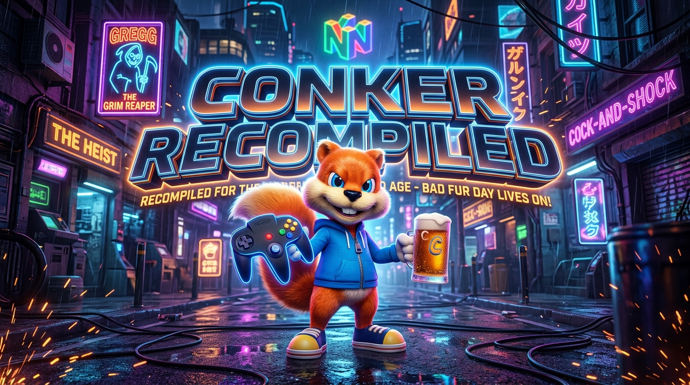

<p align="center">
  
</p>

<h1 align="center">🍺 CONKER64: RECOMPILED 🐿️</h1>

<p align="center">
  <b>El Port Nativo No Oficial para PC de <i>Conker's Bad Fur Day</i> para Sistemas Modernos.</b><br>
  Construido mediante Recompilación Estática, C++20, SDL2 y Renderizado Acelerado por Hardware.
</p>

<p align="center">
  <a href="README.md"></a>
  
  
  
  
</p>

---

## ⚡ ¿Qué es este proyecto?

En 2001, **Rareware** llevó el hardware de Nintendo 64 a su límite absoluto con *Conker's Bad Fur Day*. Con miles de líneas de voz hablada, compresión MP3 en tiempo real, animaciones faciales avanzadas y geometría 3D densa, la consola original sufría caídas constantes a unos dolorosos **12–18 FPS**.

**CONKER64: RECOMPILED** busca solucionar esto para siempre. En lugar de usar emulación tradicional de alto consumo, este proyecto utiliza **Recompilación Estática (MIPS ➔ C++ Nativo x86_64)** para traducir la lógica original del juego directamente a instrucciones nativas de tu procesador.

### 🌟 Características Principales
- 🚀 **Fluidez Total:** 60 FPS, 120 FPS y Tasa de Refresco Desbloqueada de forma nativa.
- 🖥️ **Pantalla Panorámica y Ultra-Ancha:** Soporte nativo para 16:9 y 21:9 con campo de visión (FOV) escalado.
- 🎮 **Controles Modernos y Baja Latencia:** Soporte para mandos de Xbox, PlayStation DualSense, Switch Pro Controller y Teclado/Ratón mediante SDL2.
- 🎨 **Mejoras Visuales:** Diseñado para soportar RT64 (Ray Tracing), Texturas en Alta Definición (HD) y Post-procesado moderno.
- 💾 **Guardado Oficial Persistente:** Emulación del chip de hardware EEPROM de 16Kbit guardado directamente en `%APPDATA%\ConkerRecompiled`.
- 🛠️ **Soporte de Mods:** API de inyección en C++ para niveles personalizados, skins y mejoras de la comunidad.

---

## 📊 Estado Actual del Proyecto

- [x] **Pipeline de ROM Verificado:** Extracción bit-perfect de la versión NTSC USA (`SHA-1: 4CBADD3C4E0729DEC46AF64AD018050EADA4F47A`).
- [x] **Descompresión Propietaria de Rareware:** Algoritmo RZIP y descifrado XOR (`0x8039CCCA`) implementados y funcionales.
- [x] **Motor Base x64 Nativo:** Estructura en C++20 con SDL2 y bucle de eventos a 60 FPS con V-Sync.
- [x] **Memoria Virtual RDRAM & Interfaz VI:** 8MB Expansion Pak con decodificación de texturas 4:3 en GPU.
- [x] **Sistema de Guardado Oficial:** Hooks de `libultra` `osEeprom` conectados con la carpeta de usuario de Windows.
- [x] **Desensamblado de Instrucciones MIPS:** Análisis de símbolos de los binarios `init` y `code`.
- [ ] **Emulación de Microcódigo Gráfico Gfx / RSP:** Intercepción de listas de comandos (Display Lists) para Vulkan / DirectX 12.
- [ ] **Streamer de Audio DMA:** Reproducción multicanal de audio PCM y voces en formato MP3.

---

## 🛠️ Cómo Compilar desde el Código Fuente

### Requisitos Previos
- **Visual Studio 2022 o 2026** (Desarrollo para el escritorio con C++)
- **CMake** 3.20+
- **Python** 3.10+ (con `splat64`, `spimdisasm`, `m2c`)
- **Git**

### Paso a Paso
```bash
# 1. Clonar el repositorio
git clone https://github.com/Conker64Recomp/conker64-recompiled.git
cd conker64-recompiled/recomp

# 2. Compilar el ejecutable nativo
build_game.bat

# 3. Iniciar el juego
.\build\Conker.exe
```

---

## ⚖️ Aviso Legal y Descargo de Responsabilidad

Este proyecto es un trabajo de ingeniería inversa de sala limpia y preservación digital creado con fines educativos y de interoperabilidad.

- **NO SE DISTRIBUYEN ARCHIVOS CON DERECHOS DE AUTOR:** Este repositorio no contiene ROMs del juego, texturas protegidas, modelos 3D, pistas de audio con copyright ni binarios propiedad de Nintendo Co., Ltd., Rare Ltd. o Microsoft Corporation.
- **REQUISITO DE ROM:** Cada usuario debe proveer su propia copia legalmente adquirida de *Conker's Bad Fur Day (USA)* (`baserom.us.z64`) para compilar y jugar.
- Todos los nombres de productos y empresas son marcas comerciales™ o registradas® de sus respectivos propietarios.

---

<p align="center">
  <i>Desarrollado con ❤️ por la comunidad de Conker Recompiled. ¡Bad Fur Day vive!</i>
</p>
