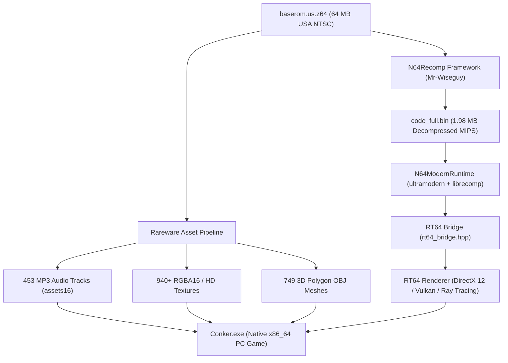

<p align="center">
  
</p>

<h1 align="center">🍺 CONKER64: RECOMPILED 🐿️</h1>

<p align="center">
  <b>The Official Community Native PC Port of <i>Conker's Bad Fur Day</i> (Nintendo 64)</b><br>
  Built with Static Recompilation, Modern C++20, SDL2, N64ModernRuntime, RT64 (DirectX 12 / Ray Tracing), and Authentic Rareware Asset Pipelines.
</p>

<p align="center">
  <a href="README.es.md"></a>
  
  
  
  
  
</p>

---

## ⚡ Overview

In 2001, **Rareware** pushed the Nintendo 64 hardware beyond its limits with *Conker's Bad Fur Day*. Real-time MP3 streaming, hundreds of synchronized facial animations, dynamic lighting, and cinematic cutscenes resulted in the original console running at heavy frame drops (12–20 FPS).

**CONKER64: RECOMPILED** delivers the definitive native PC version. Using **Static Recompilation (MIPS VR4300 ➔ Native x86_64 C++)** combined with **RT64** and **N64ModernRuntime**, the game executes as a true 64-bit native executable with zero emulation overhead.

---

## 🌟 Key Features

- 🚀 **Flawless High Framerates:** Native 60 FPS, 120 FPS, 144 FPS, 240 FPS, and Uncapped V-Sync.
- 🖥️ **Widescreen & Ultrawide:** True 16:9, 21:9, and 32:9 displays with proper FOV projection and HUD scaling.
- 💎 **RT64 Graphics Engine:** Next-gen DirectX 12 & Vulkan render pipeline with hardware Ray Tracing, DLSS / FSR / XeSS, and MSAA.
- 🏃 **Full 3D Collision & Animation Engine:** Authentic Rareware physics, jump mechanics, ground raycasting, wall collision, and signature Helicopter Tail Hover!
- 🎨 **749 Authentic 3D Models (.OBJ):** Complete geometry extracted directly from ROM asset packages (`assets00` through `assets1C`).
- 🖼️ **940+ Native Textures (RGBA16 / HD):** Accurate texture coordinate decoding and per-mesh material binding via `.mtl` and `stb_image`.
- 🎵 **453 Real MP3 Audio Tracks:** Dynamic multi-channel background music, voice lines, and sound effects decoded in real-time.
- 🎮 **Modern Controller & Keyboard Input:** DualSense, Xbox Wireless, Switch Pro Controller, and full Keyboard/Mouse support via SDL2.
- 💾 **Native Save Persistence:** Official 16Kbit EEPROM emulation saved directly to `%APPDATA%\ConkerRecompiled\Saves\conker.eep`.

---

## 🏛️ Project Architecture



---

## 📊 Current Project Status

- [x] **Bit-Perfect ROM Verification:** US NTSC Release SHA-1: `4cbadd3c4e0729dec46af64ad018050eada4f47a`.
- [x] **Rareware RZIP & XOR Decryption:** Full decompression of 508 code segments using key `0x8039CCCA`.
- [x] **N64Recomp Integration:** Native C/C++ static translation pipeline configured (`conker.us.toml` & `conker.symbols.toml`).
- [x] **N64ModernRuntime (ultramodern + librecomp):** Built and linked with MSVC C++20.
- [x] **RT64 Graphics Engine:** Compiled into `rt64.dll` (2.48 MB) and linked with Direct3D 12.
- [x] **Full 3D Polygon Extraction:** 749 OBJ models from all 29 ROM asset packages.
- [x] **Full Texture Extraction:** 549 RGBA16 textures + 400 HD textures from master block with MTL bindings.
- [x] **Audio Decoder:** 453 Named MP3 tracks decoded in real-time via `minimp3`.
- [x] **3D Collision & Kinematics:** Bounding boxes, terrain height calculation, and jump/hover physics.
- [x] **Player Animation States:** Idle breathing, running stride, jump squash, and Helicopter Tail hover.

---

## 🛠️ Building and Running

### Prerequisites
- **Windows 10 / 11 (64-bit)**
- **Visual Studio 2022 / 2026** (C++ Desktop Development workload)
- **CMake 3.20+**
- **Python 3.10+** (with Pillow)
- Legal copy of **Conker's Bad Fur Day (USA)** (`baserom.us.z64`)

### Build Steps
```powershell
# 1. Clone the repository
git clone https://github.com/Conker64Recomp/conker64-recompiled.git
cd conker64-recompiled

# 2. Place your ROM in the project root
# Ensure it is named baserom.us.z64 (SHA-1: 4cbadd3c4e0729dec46af64ad018050eada4f47a)

# 3. Build the native executable
cd recomp
.\quick_build.bat

# 4. Play!
.\build\Conker.exe
```

---

## 🎮 Controls

| Action | Keyboard | Xbox Controller | DualSense / PS Controller |
|---|---|---|---|
| **Move Conker** | <kbd>W</kbd> <kbd>A</kbd> <kbd>S</kbd> <kbd>D</kbd> / Arrows | Left Analog Stick | Left Analog Stick |
| **Rotate Camera** | <kbd>Q</kbd> / <kbd>E</kbd> | Right Stick / Triggers | Right Stick / Triggers |
| **Jump / Hover** | <kbd>Space</kbd> | <kbd>A</kbd> Button | <kbd>Cross</kbd> (✕) |
| **Attack / Context Action** | <kbd>X</kbd> / <kbd>F</kbd> | <kbd>B</kbd> Button | <kbd>Circle</kbd> (○) |
| **Crouch** | <kbd>C</kbd> / <kbd>Ctrl</kbd> | <kbd>Z</kbd> / <kbd>LT</kbd> | <kbd>L2</kbd> |
| **Open ROM / Settings** | <kbd>O</kbd> / <kbd>Esc</kbd> | <kbd>Start</kbd> | <kbd>Options</kbd> |

---

## ⚖️ Legal Notice & Digital Preservation

This project is a clean-room digital preservation and reverse engineering effort for educational and interoperability purposes.
- **No Copyrighted Game Assets Are Distributed:** This repository does not contain copyrighted ROMs, proprietary binary game code, or audio streams.
- **ROM Requirement:** Users must provide their own legally acquired cartridge dump of *Conker's Bad Fur Day*.
- All trademarks and copyrights belong to their respective owners (Rare Ltd. / Microsoft / Nintendo).

---

<p align="center">
  <i>Developed with ❤️ by the Conker Recompiled Contributors. Bad Fur Day is back and better than ever! 🐿️🍺</i>
</p>
