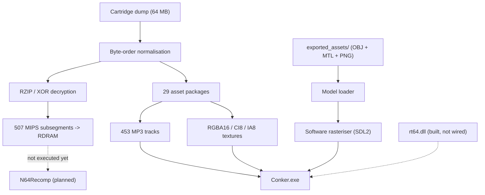

<p align="center">
  
</p>

<h1 align="center">🍺 CONKER64: RECOMPILED 🐿️</h1>

<p align="center">
  <b>A native C++20 engine and asset pipeline for <i>Conker's Bad Fur Day</i> (Nintendo 64)</b><br>
  Reads a real cartridge dump, decrypts and decompresses Rareware's RZIP archives,
  and renders an interactive 3D scene from the data it recovers.
</p>

<p align="center">
  <a href="README.es.md"></a>
  
  
  
  
</p>

---

## ⚡ What this actually is

This is **not a finished static recompilation** of *Conker's Bad Fur Day*, and it does not
play the game. Setting expectations honestly up front:

It **is** a working reverse-engineering toolkit and 3D engine, written from scratch in
C++20 on SDL2, that:

- Loads a real 64 MB cartridge dump and validates its header.
- Breaks Rareware's RZIP container format — XOR-encrypted offset table (key `0x8039CCCA`)
  plus raw-deflate payloads — and recovers **507 of 508 executable code subsegments**
  (~2 MB of MIPS) into an emulated 8 MB RDRAM.
- Indexes and plays back **453 MP3 audio streams** embedded in the cartridge.
- Decodes every native N64 texture format (RGBA16/32, IA16/8, CI8/4, I8).
- Renders an explorable 3D scene with its own software rasteriser: Gouraud shading,
  back-face culling, painter's-algorithm depth sorting, distance fog, and a
  procedural skeletal-animation rig for the player character.

The recovered MIPS code sits in RDRAM but **is not executed yet**. Wiring up N64Recomp
so that it runs is the project's central open problem — see the roadmap.

---

## 📊 Current status

### Working

| Area | Detail |
|---|---|
| ROM ingestion | Byte-order detection for `.z64` / `.v64` / `.n64`, auto-normalised to big-endian. Header parsed field-by-field. |
| RZIP decryption | 508 offsets decrypted, 507 code subsegments decompressed into RDRAM. |
| Asset packages | All 29 Rareware packages (`assets00`–`assets1C`) located and enumerated. |
| Audio | 453 MP3 tracks indexed from `assets16`, decoded with `minimp3`, resampled to the output device via `SDL_AudioStream`. |
| Texture decoding | RGBA16, RGBA32, IA16, IA8, CI8, CI4, I8 → RGBA8888. |
| Save data | 16 Kbit EEPROM (256 × 8-byte blocks) persisted to `%APPDATA%\ConkerRecompiled\Saves\conker.eep`, behind `osEeprom*` hooks. |
| Renderer | Batched `SDL_RenderGeometry` — one draw call per mesh instead of one per triangle. Measured 50–90 FPS at 1280×720 with a 35 k-triangle scene. |
| Player controller | Camera-relative movement, gravity, jump, wall/ledge collision, and the signature helicopter-tail hover. |

### Partial

- **Extracted 3D models.** 750 `.obj` files were recovered from the asset packages, but
  the extractor is pattern-matching bytes rather than following F3DEX2 display lists
  properly: **590 of them contain fewer than 10 faces**, and only 20 exceed 100. The
  supplied `conker_character.obj` is 4 triangles, so the engine falls back to a
  procedural character model.
- **Material bindings.** 749 `.mtl` files exist, but every one of them points at the
  *same* texture (`assets00_tex_006_32x32.png`). Per-mesh texture assignment still needs
  to be derived from `G_SETTIMG` / `G_SETTILE` commands.
- **Intro sequence.** A placeholder state machine with coloured rectangles, not the
  real Rareware cinematic.

### Not started

- **Execution of the recompiled MIPS code.** `conker.us.toml` and `conker.symbols.toml`
  are written, but N64Recomp has not been run and `recomp/src/generated/` is empty.
- **RT64 integration.** `rt64.dll` builds and is copied next to the executable, and
  `rt64_bridge.hpp` is written against the `ultramodern` renderer interface — but nothing
  includes it yet, so all rendering currently goes through the software rasteriser.
  Ray tracing, DLSS/FSR/XeSS and hardware upscaling are **not** available.
- Game logic, enemies, NPCs, levels, HUD.

---

## 🏛️ Architecture



---

## 🛠️ Building

### Prerequisites

- Windows 10 / 11 (x64)
- Visual Studio 2022 or newer, with the C++ Desktop Development workload
- CMake 3.20+
- A legally obtained dump of *Conker's Bad Fur Day (USA)*
  — SHA-1 `4cbadd3c4e0729dec46af64ad018050eada4f47a`

SDL2 and zlib are fetched automatically by CMake; no manual setup needed.

### Build

```powershell
cd recomp
.\build_game.bat
```

`build_game.bat` does a clean configure and build. For incremental rebuilds afterwards:

```powershell
.\quick_build.bat
```

### Run

Place your ROM in the repository root as `baserom.us.z64`, then:

```powershell
.\build\Conker.exe
```

Any of `.z64`, `.v64` or `.n64` will work — the loader detects the byte order from the
signature rather than trusting the file extension. You can also drag a ROM onto the
window, or press <kbd>O</kbd> to browse for one.

Assets are located relative to the executable, so it runs correctly from any working
directory.

---

## 🎮 Controls

| Action | Keyboard | Gamepad |
|---|---|---|
| Move | <kbd>W</kbd> <kbd>A</kbd> <kbd>S</kbd> <kbd>D</kbd> | Left stick |
| Rotate camera | <kbd>Q</kbd> / <kbd>E</kbd> | C-Left / C-Right |
| Jump — hold in mid-air to hover | <kbd>Space</kbd> / <kbd>X</kbd> | <kbd>A</kbd> |
| Attack | <kbd>C</kbd> / <kbd>Z</kbd> | <kbd>X</kbd> |
| Cycle ROM texture | <kbd>Tab</kbd> / <kbd>1</kbd>–<kbd>9</kbd> | — |
| Open ROM | <kbd>O</kbd> | — |
| Quit | <kbd>Esc</kbd> | — |

Movement is relative to the camera, so "forward" follows wherever you have rotated the view.

---

## 🗺️ Roadmap

1. **Fix the asset extractor.** Walk F3DEX2 display lists properly (`G_VTX` → matrix
   stack → `G_TRI1`/`G_TRI2`) instead of scanning for byte patterns, and read real
   per-mesh texture bindings from `G_SETTIMG`/`G_SETTILE`. This is what unlocks the
   remaining ~98% of the geometry.
2. **Run the recompiled code.** Initialise the submodules, build N64Recomp, translate
   `code_full.bin` using the existing TOML configs, and compile the generated C into the
   executable.
3. **Wire up RT64.** `rt64_bridge.hpp` is written but unreferenced; connecting it needs
   `N64ModernRuntime` built and the display-list pipeline feeding it real F3DEX2 commands.
4. **Game systems.** Enemies, NPCs, level loading, HUD.

---

## 🤝 Contributing

The most valuable contribution right now is item 1 on the roadmap — the asset extractor.
Everything downstream is bottlenecked on the quality of the extracted geometry.

To get the submodules (needed for items 2 and 3):

```powershell
git submodule update --init --recursive
```

---

## ⚖️ Legal notice

This project is a reverse-engineering and digital-preservation effort for educational and
interoperability purposes.

- **No copyrighted assets are distributed.** This repository contains no ROM, no
  proprietary game code, and no audio streams.
- **You must supply your own legally obtained cartridge dump.**
- All trademarks and copyrights belong to their respective owners (Rare Ltd. / Microsoft /
  Nintendo).

Licensed under the MIT License — see [LICENSE](LICENSE).
